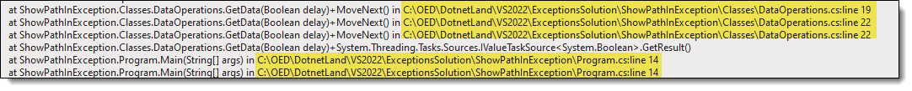
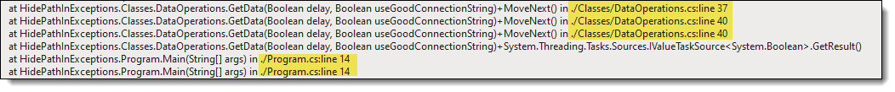

# Hiding path for runtime exceptions

When an unhandled or handled (using try-catch) exception is thrown in an application usually the exception is sent to a log file and may display the exception during development in Visual Studio output window or if working with a console application display in the console window.

When inspecting an exception in a log file for the stack trace we see not only the location of the exception but the full path too, as shown in figure 1. If seeing the full path is annoying than there is a solution that when implemented will appear as in figure 2.


From Solution Explorer, double click on your project, add the following and save

```csharp
<PropertyGroup>
   <PathMap>$([System.IO.Path]::GetFullPath('$(MSBuildThisFileDirectory)'))=./</PathMap>
</PropertyGroup>
```

Run, inspect and note no path. Rather than write code I've supplied one project `ShowPathInException` which shows full paths while `HidePathInExceptions` does not show the full path.

Note that both use [Serilog](https://serilog.net/) to log exceptions to each project's Debug folder.


## Figure 1



</br>

## Figure 2



# Running the code

Run NorthScript.sql to create and populate a database used in both projects.

# Bonus 

If there are many projects consider the following.

Create a file named [Directory.Build.props](https://docs.microsoft.com/en-us/visualstudio/msbuild/customize-your-build?view=vs-2019#directorybuildprops-example) in the root path of a Visual Studio solution with the following will remove paths from eror messages in all projects.

```xml
<Project>
   <PropertyGroup>
      <PathMap>$(MSBuildProjectDirectory)=$(MSBuildProjectName)</PathMap>
   </PropertyGroup>
</Project>
```

# Code samples

Written with .NET Core 6

# .NET Core 5

The code supplied was first tested with .NET Core 5 prior to being used in this article so those still using .NET Core 5 can use this too.